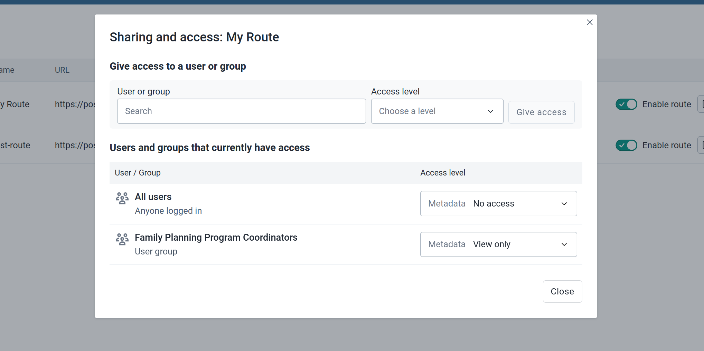

## The Route Manager app { #route_manager_app }

The core team has developed the Route Manager app to provide a user interface to manage routes through the Route API.

### App functionality

The app provides a user interface for the API described above. It is inevitable that the API will be ahead of the app at certain times, but the app is on continuous release and will catch up with the API as soon as possible. For these use cases, you can always directly use the API (or contribute to the app on GitHub - we welcome contributions!)

The following is an overview of the functionality supported by the app.

#### Creating new routes

Through the app, you can create a new route by going to the Create New Route page (top-right of Home Screen).

The page allows you to define the different properties of the route. You can check the Route API documentation above for more details.

Other than the basic routes, you can also setup different authentication schemes, restrict the authorities that can run the route, and define static headers for the route.

The API is ahead of the app sometimes in terms of the functionalities it provides, i.e. it supports more authentication schemes, but the app is continuously being updated to catch up with the API.

#### Editing, deleting and disabling existing routes

In the routes list on the home page of the app, one can perform several maintenance tasks such as editing a route, deleting it, disabling it, or sharing it.

Enabling or disabling a route can be performed with the toggle button on each row.

To edit a route, click the small pencil icon. This will take you to a page similar to the _Create_ page where you can edit the route.

Click the three dots icon in the right column of the routes table to view extra options for the route, delete it, or edit sharing settings for it.

#### Testing routes

You can test a route by clicking the "Test route" button on the Routes List. This opens a screen where you can use the route to invoke the upstream server. It allows you to pass query params, the body of the request (for non-GET requests) or the rest of the path of the upstream server for wildcard routes.

On clicking Test Route, the upstream endpoint will be invoked and the result displayed.

#### Configuring the route metadata sharing

From the extended options in the Routes list (the three dots), you can open the Sharing dialog that allows to restrict access to a certain user or user group.

### How to get the app

The app is not bundled with DHIS2 but it can be installed in the App Management app under the [App Hub](https://apps.dhis2.org/app/5dbe9ab8-46bd-411e-b22f-905f08a81d78) apps.

You can also view and test the app under: https://route-manager.netlify.dhis2.org/ and pointing it, for example, to one of the dev servers on: https://debug.dhis2.org/
